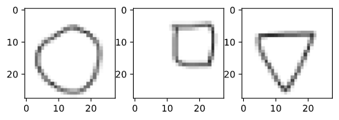
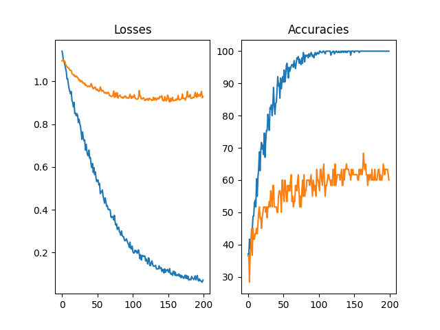

# 300 images of squares, circles, and triangles using Pytorch
This repository contains the code I've developed for the classification problem avilable on Kaggle at the following [link](https://www.kaggle.com/cactus3/basicshapes).

## The dataset
The dataset is extremaly simple as well as the classification task. There are 300 __png__  28x28 RBG images of squares, circles and triangles, namely 100 for each shape.
<p align="center">
  
</p>

The task is to develop a model that can be able to classify properly the shape in each of the input image. 
## Requirements
In order to reproduce the experiments and the results obtained in this repository you should run in your shell the following command:
```bash
$ pip install -r requirements.txt
```
The Python version I've adopted for my enviroment is 3.8.
## The model
The implemented model is a **CNN**, namely a convolutional neural networks. 

It can be visualized running the following bash comand from the _src_ folder:
```bash
~/src$ python model.py
```
and you should be able to obtain the following output
```bash
Model(
  (conv1): Conv2d(3, 64, kernel_size=(15, 15), stride=(1, 1))
  (bn1): BatchNorm2d(64, eps=1e-05, momentum=0.1, affine=True, track_running_stats=True)
  (dropout1): Dropout(p=0.1, inplace=False)
  (pool1): MaxPool2d(kernel_size=2, stride=2, padding=0, dilation=1, ceil_mode=False)
  (conv2): Conv2d(64, 16, kernel_size=(4, 4), stride=(1, 1))
  (bn2): BatchNorm2d(16, eps=1e-05, momentum=0.1, affine=True, track_running_stats=True)
  (pool2): MaxPool2d(kernel_size=2, stride=2, padding=0, dilation=1, ceil_mode=False)
  (fc1): Linear(in_features=64, out_features=512, bias=True)
  (bn3): BatchNorm1d(512, eps=1e-05, momentum=0.1, affine=True, track_running_stats=True)
  (dropout2): Dropout(p=0.4, inplace=False)
  (fc2): Linear(in_features=512, out_features=180, bias=True)
  (bn4): BatchNorm1d(180, eps=1e-05, momentum=0.1, affine=True, track_running_stats=True)
  (dropout3): Dropout(p=0.1, inplace=False)
  (fc3): Linear(in_features=180, out_features=3, bias=True)
)

```

## Repository structure

```
 300-image
 │   README.md
 │   LICENSE    
 │   requirements.txt
 └───src
 │   │   config.py
 │   │   preproc.py
 │   │   model.py
 |   |   train.py
 └───notebooks
 │   │   viz.ipynb
 │   │   preproc.ipynb
 │   │   output_analysis.ipynb
 └───input
 |   |   train_dataset.csv
 |   |   valid_dataser.csv
 |   └───shapes
 |        └───cirles
 |        └───squares
 |        └───triangles
 └───output
 |    |   accuracies.csv
 |    |   losses.csv
 └───documents
```

The files contained in the _input_ folder, namely the **csv files** are generated using the [prepoc.py](src/preproc.py) file. The files of the _output_ folder instead are generated 
running the [train.py](src/train.py) script.

Note that this script can be run using the following command
in your shell
```bash
~/src$ python train.py [--lr LEARNING_RATE] [--bs BATCH_SIZE] [--epochs EPOCHS]
```
that is, you can select the value of the learning rate _lr_, of the batch size _bs_, and the number of epochs you want to train the model _epochs_. The default value for each of the latter "hyperparameters" are initialized in the [config.py](src/config.py).

## Results
The execution of the model developed using the default parameters leads to the following results

<p align="center">
  
</p>

We can see that the model overfits the training set reaching 100% accuracy after more or less 100 epochs. At the same time, the accuracy on the validation set (plotted in orange) remains relatively low while the the validation loss seems too high. One of the possible solution to adopt in order to overcome this issue is to try simply the model or performing a cross-validation hyperparameters tuning strategy.

## Ideas to improve the model's results
1. Hyperparameters Tuning
2. Improving Regularization
3. Constraining Model Complexity
4. Adopt [Spatial Transformer Networks](https://pytorch.org/tutorials/intermediate/spatial_transformer_tutorial.html) as shown in the [DeepMind paper](https://arxiv.org/abs/1506.02025)


